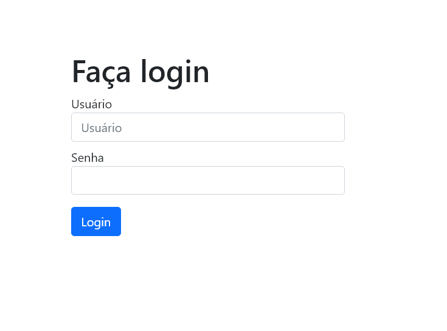
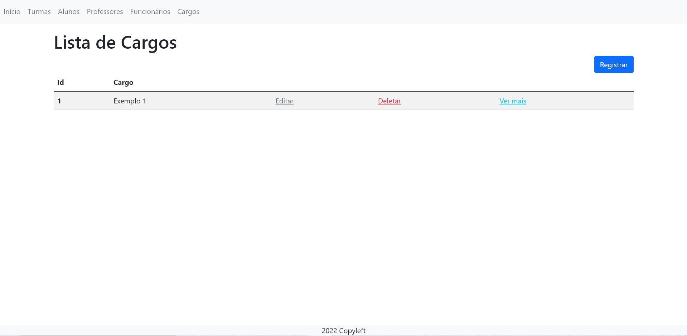
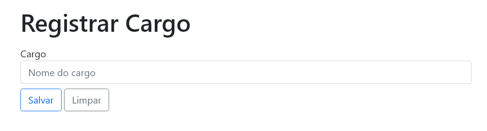
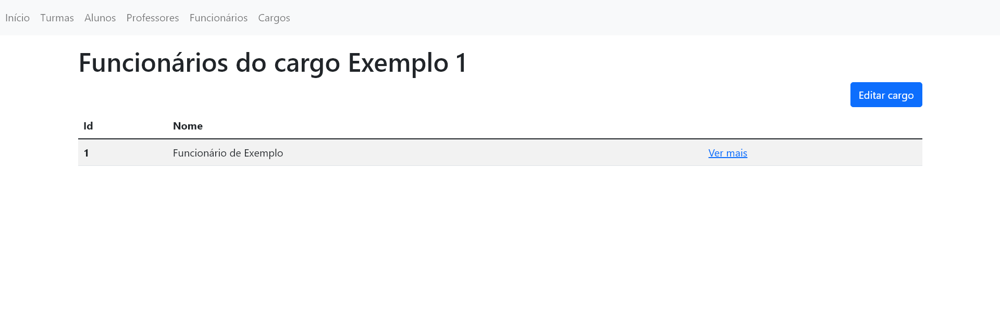
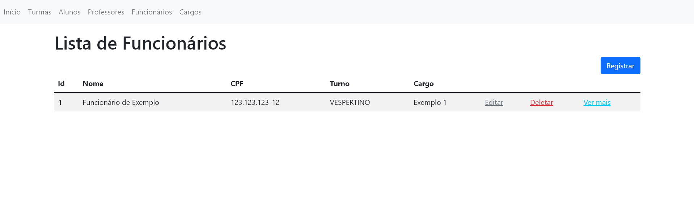
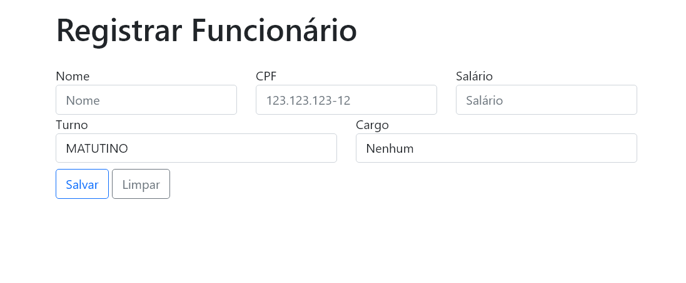
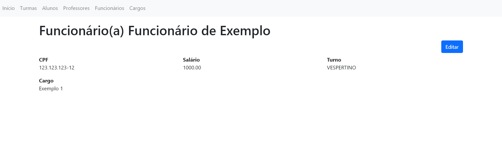

# Controle-Escola
> Status: Em desenvolvimento
- Este projeto está sendo desenvolvido para a aprendizagem do <a href="https://spring.io/">Framework Spring</a> em geral.

## Páginas

### Página de Login
#### acessado em - "/login"

- Acesso ao sistema

### Página de Cargos
#### acessado em - "/cargos"

- A página permite que o usuário:
  - Visualize e gerencie os demais cargos registrados.

### Registro de um Cargo
#### acessado em - "/cargos/registrar"

- A página permite que o usuário:
  - Registre um novo cargo no sistema.

### Cargo - Ver mais
#### acessado em - "/cargos/{id}/detalhes"

- A página permite que o usuário:
  - Visualize os funcionários relacionados com o cargo.
  - Edite o cargo.

### Página de Funcionários
#### acessado em - "/funcionarios"

- A página permite que o usuário:
  - Visualize e gerencie os funcionários registrados.

### Registro de um Funcionário
#### acessado em - "/funcionarios/registrar"

- A página permite que o usuário:
  - Registre um novo funcionário.

### Funcionário - Ver mais
#### acessado em - "/funcionarios/{id}/detalhes"

- A página permite que o usuário:
  - Visualize mais informações sobre o funcionário.
  - Edite o funcionário.
