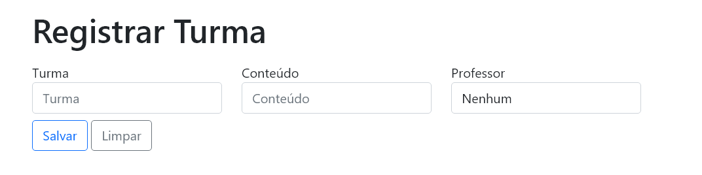

# Controle-Escola
> Status: Em desenvolvimento
- Este projeto está sendo desenvolvido para a aprendizagem do <a href="https://spring.io/">Framework Spring</a> em geral.

# Páginas

<!-- ## Login -->

### Página de Login
#### acessado em - "/login"

- Acesso ao sistema

## Cargos

### Página de Cargos
#### acessado em - "/cargos"

- A página permite que o usuário:
  - Visualize e gerencie os demais cargos registrados.

### Registro de um Cargo
#### acessado em - "/cargos/registrar"

- A página permite que o usuário:
  - Registre um novo cargo no sistema.

### Cargo - Ver mais
#### acessado em - "/cargos/{id}/detalhes"

- A página permite que o usuário:
  - Visualize os funcionários relacionados com o cargo.
  - Edite o cargo.

## Funcionários

### Página de Funcionários
#### acessado em - "/funcionarios"

- A página permite que o usuário:
  - Visualize e gerencie os funcionários registrados.

### Registro de um Funcionário
#### acessado em - "/funcionarios/registrar"

- A página permite que o usuário:
  - Registre um novo funcionário.

### Funcionário - Ver mais
#### acessado em - "/funcionarios/{id}/detalhes"

- A página permite que o usuário:
  - Visualize mais informações sobre o funcionário.
  - Edite o funcionário.

## Professores

### Página de Professores
#### acessado em - "/professores"

- A página permite que o usuário:
  - Visualize e gerencie os professores registrados.

### Registro de um Professor
#### acessado em - "/professores/registrar"

- A página permite que o usuário:
  - Registre um novo professor.

### Professor - Ver mais
#### acessado em - "/professores/{id}/detalhes"

- A página permite que o usuário:
  - Visualize as turmas do professor
  - Edite o professor.

## Turmas

### Página de Turmas
#### acessado em - "/turmas"

- A página permite que o usuário:
  - Visualize e gerencie as turmas registradas.

### Registro de uma Turma
#### acessado em - "/turmas/registrar"

- A página permite que o usuário:
  - Registre uma nova turma.

### Turmas - Ver mais
#### acessado em - "/turmas/{id}/detalhes"

- A página permite que o usuário:
  - Tenha mais informações sobre a turma.
  - Edite a turma.

## Alunos

### Página de Alunos
#### acessado em - "/alunos"

- A página permite que o usuário:
  - Visualize e gerencie os alunos registrados.

### Registro de um Aluno
#### acessado em - "/alunos/registrar"

- A página permite que o usuário:
  - Registre um novo aluno.

### Aluno - Ver mais
#### acessado em - "/alunos/{id}/detalhes"

- A página permite que o usuário:
  - Veja mais informações do aluno.
  - Altere o status do aluno.
  - Edite o aluno.
